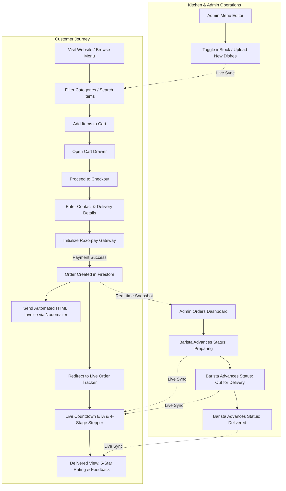

# PROJECT_FACTS.md — 7th Heaven Cafe (Brewline Cafe)

> **Document Type:** Codebase Analysis & Verification Matrix  
> **Target Project:** Final-Year Project Blackbook (Project Report)  
> **Source Base:** `c:\Users\Aditya\Desktop\cafe2`  
> **Generated Date:** September 19, 2026  

---

## 1. Project Overview & Institutional Details

- **Application Name / Brand Title:** 7th Heaven Cafe (Branded as *Brewline Cafe / Brewline. Coffee & People* in the modern frontend redesign)
- **Primary Description:** A cloud-native, full-stack digital ordering, real-time order lifecycle tracking, and kitchen operations management web platform tailored for artisanal cafes and bakehouses.
- **Student Details:**
  - **Student Full Name:** [TO FILL: e.g. Aditya Sharma] *(Note: Aditya found in QA Lead & Git author records)*
  - **Roll No:** [TO FILL]
  - **Seat No:** [TO FILL]
  - **Degree / Class:** [TO FILL: e.g., T.Y.B.Sc. Computer Science / Information Technology, Semester VI]
  - **Academic Year:** [TO FILL: e.g., 2025–2026]
  - **College Name & Address:** [TO FILL: e.g., College Name, Department of Computer Science, University of Mumbai / Pune]
  - **Department:** [TO FILL: Department of Computer Science / Information Technology]
  - **Project Guide / Supervisor:** [TO FILL: Prof. Guide Name]
  - **Project Duration:** [TO FILL: e.g., 12–16 Weeks]

---

## 2. Technology Stack & Key Dependencies

Derived directly from `package.json` and active source code:

| Layer | Technology | Version | Purpose / Role |
| :--- | :--- | :--- | :--- |
| **Frontend Framework** | **Next.js (App Router)** | `16.2.3` | Modern React framework with hybrid Server/Client components, SSR, API routes |
| **Core UI Library** | **React & React DOM** | `19.2.4` | Component-based interactive user interface rendering |
| **Styling & Design System** | **Tailwind CSS & PostCSS** | `4.2.2` / `8.5.9` | Utility-first styling with custom cafe color tokens, glassmorphism, and responsive layouts |
| **Animations & Transitions** | **Framer Motion** | `12.38.0` | Fluid drawer transitions, quantity counter spring physics, popup animations |
| **Cinematic Motion** | **GSAP & @gsap/react** | `3.15.0` / `2.1.2` | Editorial hero section headline & card staggered entrance animations |
| **Smooth Scrolling** | **Lenis** | `1.3.25` | Momentum-based buttery-smooth scroll behavior |
| **Iconography** | **Lucide React** | `1.8.0` | Comprehensive iconography across customer and admin portals |
| **Backend & Cloud Services** | **Google Firebase Web SDK** | `12.11.0` | Firebase Auth, Cloud Firestore (NoSQL), Cloud Storage |
| **Authentication** | **Firebase Auth** | `12.11.0` | Email/Password credentials and Google OAuth Single Sign-On (Popup) |
| **Database** | **Google Cloud Firestore** | `12.11.0` | Document-oriented real-time cloud NoSQL database with snapshot listeners |
| **Object Storage** | **Firebase Cloud Storage** | `12.11.0` | Cloud bucket for menu item photography and user avatar uploads |
| **Payment Processing** | **Razorpay Node SDK & Checkout** | `2.9.8` | Server-side order token generation and client-side modal gateway (UPI/Cards/Netbanking) |
| **Transaction Emailing** | **Nodemailer** | `8.0.5` | Automated HTML digital invoice delivery via SMTP (Gmail App Password / Ethereal fallback) |
| **Class Utilities** | `clsx`, `tailwind-merge` | `2.1.1` / `3.5.0` | Dynamic style merging and conditional CSS classes |

---

## 3. Application Modules

### 3.1 Customer Facing Modules
1. **Brand Hero & Landing Module (`components/Hero.js`, `app/page.js`):**
   - Editorial typography (*Playfair Display*, *Cormorant Garamond*, *Outfit*).
   - GSAP staggered entrance animations.
   - Interactive "Today's Ritual" floating highlight card with daily featured brew.
2. **Menu Catalog & Category Navigation (`app/menu/page.js`, `components/MenuGrid.js`):**
   - 17 distinct canonical cafe categories (Hot Coffee, Cold Coffee, Between the Breads, Burgers, Veg Hot Dogs, Starters & Appetizers, Soups, Pasta, Pizza, Main Course Indo-Chinese, Sizzlers, Sides & Breads, Milkshakes, Cupcake Milkshakes, Refreshers & Iced Teas, Mug Cakes, Desserts & Bakery).
   - Real-time instant search bar.
   - Quick Filter chips: *Veg Only* (pure vegetarian badge), *Beverages*, and *Under ₹150*.
   - Floating Menu Navigator popup anchored at bottom right with category item counts and smooth scroll jumping.
   - Pure Vegetarian indicator dot next to item names.
3. **Cart & Centralized Pricing Engine (`context/CartContext.js`, `components/CartDrawer.js`, `lib/pricing.js`):**
   - Slide-over / full-overlay cart drawer.
   - Dynamic quantity increment/decrement (+ / -) with automatic removal on zero.
   - Subtotal calculation, 5% Goods and Services Tax (GST) computation, and flat ₹40 delivery fee.
   - Auto-clear on user logout and unauthenticated guards.
4. **Checkout & Customer Validation Module (`app/checkout/page.js`):**
   - Delivery information form: Full Name, Phone Number, Email Address (for digital invoice delivery), and complete Delivery Address.
   - Profile auto-population when logged in.
   - Saved Address quick-selection pills.
   - Strict client-side validation: blocks order placement until all 4 core contact/address parameters are valid.
   - Automatic background profile synchronization to save new addresses.
5. **Payment Processing Module (`app/api/razorpay/route.js`, `app/checkout/page.js`):**
   - Dynamic script injection of Razorpay Checkout (`checkout.js`).
   - Server-side order initialization returning `order_id` in INR paise.
   - Direct handling of payment success callbacks (`razorpay_payment_id`, `razorpay_order_id`).
   - Graceful offline / test-mode fallback order placement if keys are unconfigured.
6. **Automated Digital Invoicing & Email Module (`app/api/send-order-email/route.js`, `components/InvoiceModal.js`):**
   - Standard 8.5" x 11" printable letter-size invoice preview modal with print stylesheet triggers.
   - Background asynchronous Nodemailer dispatch delivering a responsive HTML receipt to the customer's mailbox.
7. **Real-time Order Lifecycle Tracker (`app/track-order/[orderId]/page.js`, `components/FloatingOrderTracker.js`):**
   - Real-time `onSnapshot` synchronization reflecting kitchen status updates instantaneously.
   - Active ETA countdown timer recalculating remaining delivery minutes.
   - 4-Stage visual stepper: **Placed** &rarr; **Preparing** &rarr; **Out for Delivery** &rarr; **Delivered**.
   - Delivered View: Displays delivery completion checkmark, item recap, re-order CTAs, and interactive 5-star delivery experience rating + feedback text submission.
   - Persistent bottom floating order badge (`FloatingOrderTracker.js`) for customers navigating away from tracking.
8. **Authentication & Profile Management (`context/AuthContext.js`, `components/ProfileDrawer.js`, `app/login/page.js`, `app/signup/page.js`):**
   - Email and password sign-up and sign-in.
   - Google OAuth popup sign-in.
   - Profile Drawer: Personal details editor (Name, DOB, Phone, Gender, Newsletter toggle).
   - Profile photo upload with client-side HTML5 canvas image compression before Firebase Storage upload.
   - Past Order History list with instant invoice modal inspection.

### 3.2 Administrator & Kitchen Operations Modules (`app/admin/page.js`)
1. **Role-Based Access Guard:**
   - Evaluates `profile.role === 'admin'`. Non-admin sessions are automatically redirected to `/`.
2. **Operations Dashboard & KPI Metrics:**
   - Real-time KPI summary cards: Total Revenue (₹), Total Orders, Pending Orders requiring attention, and Active Menu Items.
   - Custom SVG Area Chart visualizing 12-month historical revenue curves with peak tooltips.
   - Kitchen Traffic distribution vertical bars (Accepted, Preparing, Delivered proportions).
3. **Live Orders Queue & Kanban Controller:**
   - Real-time listener for incoming orders with audio notification popover.
   - Search orders by customer name or Order ID.
   - Filter tabs: *All, Accepted (Placed), Preparing, Out for Delivery, Delivered*.
   - Inline status dropdown selector (`StatusSelect`) updating Firestore document timestamps (`placedAt`, `preparingAt`, `outForDeliveryAt`, `deliveredAt`).
   - Order deletion and invoice preview modal.
4. **Menu Catalog & Inventory Editor:**
   - Catalog browser with search by dish name or category.
   - Instant Stock Availability switch: toggles `inStock: true / false` in Firestore, instantly changing customer menu cards to "Available" or "Sold Out".
   - New Item Creation modal: Name, Category, Price, Stock status, and product photo upload to Firebase Storage bucket.
   - Item deletion with confirmation prompt.

---

## 4. Application Routes & APIs

### 4.1 Page Routes (App Router)

| Route Path | File Location | Access Control | Purpose |
| :--- | :--- | :--- | :--- |
| `/` | `app/page.js` | Public | Brand landing page, Story, Featured grid, Location/Visit, Cart drawer |
| `/menu` | `app/menu/page.js` | Public | Full artisanal menu catalog with 17 categories, quick filters, sticky pills, floating menu popup |
| `/checkout` | `app/checkout/page.js` | Public / Customer | Contact & address details form, validation, price breakdown, Razorpay checkout |
| `/track-order/[orderId]` | `app/track-order/[orderId]/page.js` | Public / Customer | Live real-time order tracking stepper, countdown ETA, item details, rating submission |
| `/admin` | `app/admin/page.js` | Admin Only (`role === 'admin'`) | Analytics overview, revenue charts, live orders management, menu editor |
| `/login` | `app/login/page.js` | Public | Customer email/password authentication & Google OAuth sign-in |
| `/signup` | `app/signup/page.js` | Public | Customer registration form with email/password & Google OAuth |

### 4.2 Backend API Routes

| Endpoint | Method | File Location | Purpose & Implementation |
| :--- | :--- | :--- | :--- |
| `/api/razorpay` | `POST` | `app/api/razorpay/route.js` | Accepts `{ amount, currency, receipt }`, converts amount to paise, calls `razorpay.orders.create()`, returns order object and `keyId`. |
| `/api/send-order-email` | `POST` | `app/api/send-order-email/route.js` | Accepts customer and order details, generates a branded HTML invoice email, dispatches via Nodemailer with Gmail SMTP / Ethereal fallback. |

---

## 5. Database Schema & Data Models (Google Cloud Firestore)

The system utilizes Google Cloud Firestore (NoSQL document store). Data models follow a denormalized point-in-time snapshot design to ensure historical financial immutability.

### 5.1 `users` Collection
Primary Key: `uid` (matches Firebase Authentication UID)

| Field Name | Type | Constraints / Rules | Description |
| :--- | :--- | :--- | :--- |
| `uid` | String | PK (Doc ID) | Unique user identification assigned by Firebase Auth |
| `name` | String | Required | Full name of the user or administrator |
| `email` | String | Required, Unique | Email address used for authentication and invoices |
| `phone` | String | Optional | Contact phone number for delivery updates |
| `dob` | String | Optional | Date of birth for birthday promotions |
| `gender` | String | Optional | User gender specification |
| `newsletter` | Boolean | Default: `true` | Promotional newsletter email opt-in flag |
| `role` | String | Enum: `['admin', 'user']` | Access privilege level (Default: `'user'`) |
| `addresses` | Array of Strings | Optional | List of saved physical customer delivery addresses |
| `photo` | String (URL) | Optional | Cloud Storage URL of compressed profile avatar |
| `createdAt` | Timestamp | Auto | Timestamp of account registration |

### 5.2 `menu` Collection
Primary Key: `id` (Auto-generated Firestore Document ID)

| Field Name | Type | Constraints / Rules | Description |
| :--- | :--- | :--- | :--- |
| `id` | String | PK (Doc ID) | Unique identifier for menu catalog item |
| `name` | String | Required | Title of the beverage or food dish |
| `category` | String | Required | Category grouping (e.g. *Hot Coffee, Pasta, Pizza*) |
| `price` | Number | Required, &ge; 0 | Base selling price in INR (₹) |
| `description` | String | Optional | Culinary description and ingredient highlights |
| `image` | String (URL) | Optional | Firebase Storage download URL for item picture |
| `inStock` | Boolean | Default: `true` | Live stock toggle (controls customer ordering availability) |
| `createdAt` | Timestamp / ISO | Optional | Record creation timestamp |

### 5.3 `orders` Collection
Primary Key: `id` (Auto-generated Firestore Document ID)

| Field Name | Type | Constraints / Rules | Description |
| :--- | :--- | :--- | :--- |
| `id` | String | PK (Doc ID) | Unique Firestore order transaction identifier |
| `userId` | String | Required | Customer `uid` or `'guest'` for unauthenticated checkout |
| `customerName` | String | Required | Name of recipient for delivery |
| `customerEmail` | String | Required | Email address for digital invoice delivery |
| `customerPhone` | String | Required | 10-digit mobile contact number |
| `customerAddress` | String | Required | Complete physical delivery location |
| `items` | Array of Objects | Required | Immutable snapshot of purchased line items |
| `items[].id` | String | Required | Menu item document ID reference |
| `items[].name` | String | Required | Point-in-time item name at purchase |
| `items[].price` | Number | Required | Point-in-time unit price at purchase |
| `items[].qty` | Number | Required, &ge; 1 | Units ordered |
| `subtotal` / `total` | Number | Required | Sum of line item amounts |
| `taxes` | Number | Required | 5% GST tax component |
| `deliveryFee` | Number | Required | Flat packaging/delivery charge (₹40) |
| `grandTotal` | Number | Required | Net payable transaction amount |
| `status` | String | Required | Enum: `['placed', 'preparing', 'out_for_delivery', 'delivered']` |
| `paymentMethod` | String | Required | e.g. `'Paid via Razorpay'` or `'Online Payment'` |
| `razorpayOrderId` | String | Optional | Order token ID from Razorpay gateway |
| `razorpayPaymentId`| String | Optional | Transaction payment capture ID from Razorpay |
| `timestamp` / `placedAt` | ISO String | Required | Order placement timestamp |
| `preparingAt` | ISO String | Optional | Timestamp when kitchen moved order to preparing |
| `outForDeliveryAt` | ISO String | Optional | Timestamp when order was dispatched with courier |
| `deliveredAt` | ISO String | Optional | Timestamp when courier confirmed delivery |
| `estimatedDeliveryAt` | ISO String | Required | Projected arrival time (placedAt + 25 mins) |
| `rating` | Number (1–5) | Optional | Post-delivery star rating submitted by customer |
| `feedback` | String | Optional | Customer delivery experience review text |
| `ratedAt` | ISO String | Optional | Timestamp of rating submission |

---

## 6. User Roles and Security Boundaries

1. **Customer (Authenticated User):**
   - Can register, login, sign in via Google OAuth, view/edit their profile, upload avatars, and maintain saved addresses.
   - Can add items to cart, initiate checkout, pay via Razorpay, and trigger automated invoice delivery.
   - Can track their orders via real-time listeners, view historical receipts, and submit feedback ratings.
   - Scoped access: Customers can only query their own orders (`where("userId", "==", user.uid)`).
2. **Guest User (Unauthenticated):**
   - Can freely explore the brand story, browse the complete 17-category menu, filter dishes, and build a local cart.
   - Prompted to log in upon adding items or at checkout. If checking out directly, guest order IDs are stored in `localStorage` (`7h_active_orders`) allowing real-time order tracking.
3. **Administrator / Kitchen Manager:**
   - Protected route `/admin` strictly guarded by `profile?.role === 'admin'`.
   - Has full visibility over all orders across all users in real-time.
   - Can update order lifecycle states (`Accepted` &rarr; `Preparing` &rarr; `Out for Delivery` &rarr; `Delivered`), triggering automatic customer tracker stepper advancements.
   - Can toggle item inventory availability (`inStock`) and publish new menu items with image uploads.
   - Access to analytical KPI totals, top-selling items breakdown, and 12-month SVG revenue trend charts.

---

## 7. Main System Workflows

---

## 8. Current Implementation Status vs Future Scope (Integrity Check)

To adhere strictly to blackbook guidelines (**no false achievements or fabricated benchmarks**):

### What is Fully Implemented & Working in Code:
- Responsive editorial frontend with Tailwind CSS v4, custom cafe themes, and GSAP/Framer Motion animations.
- 17 canonical food & beverage menu categories with real-time text search and filter chips (*Veg Only, Beverages, Under ₹150*).
- Full Cart Drawer with live line-item modification and centralized pricing math (Subtotal + 5% GST + ₹40 Delivery Fee).
- User Profile Drawer with multi-address management and client-side canvas avatar image compression.
- Checkout page with strict 4-field validation and automated address book synchronization.
- Server-side Razorpay payment order initialization route and client checkout modal handler.
- Server-side Nodemailer email invoice transmission with responsive HTML tables.
- Real-time order tracker with live ETA countdown, 4-stage stepper, and post-delivery star rating/feedback submission.
- Real-time floating order tracker popover tracking active orders for both logged-in users and guest sessions.
- Printable standard 8.5" x 11" Letter-size Invoice Modal.
- Admin portal with live revenue KPIs, 12-month SVG sales curve, orders queue with inline status advancement, and menu stock toggle.

### What is Half-Built, Simulated, or Deferred to Future Scope:
1. **Dine-in / Table QR Ordering:** Mentioned in early architecture wireframes, but currently the customer checkout defaults to Door Delivery / Cafe Pickup without active table-number selection. *(Categorized under Limitations & Future Scope)*.
2. **Promotional Coupon Engine:** Wireframed in early documentation (e.g. `7HFIRST`), but current cart and checkout calculate standard pricing without dynamic discount code validation. *(Categorized under Future Scope)*.
3. **Dedicated Barista KDS Screen:** Kitchen operations are currently managed within the central `/admin` dashboard rather than an isolated kitchen display tablet interface. *(Categorized under Future Scope)*.
4. **Push Notifications:** Order updates currently rely on live Firestore snapshot listeners while the web app is open, rather than background Web Push / FCM service workers. *(Categorized under Future Scope)*.

---

## 9. Verification & Confirmation Required

Please review and confirm the above facts:
1. Are the listed modules, database collections, and technical stack accurate to your satisfaction?
2. Which project name do you prefer for the formal blackbook cover and headings: **"7th Heaven Cafe"** or **"Brewline Cafe (7th Heaven Cafe)"**?
3. Please provide your institutional details to replace placeholders in the Front Matter:
   - Full Name, Roll Number, Seat Number
   - Degree / Class (e.g. T.Y.B.Sc. Computer Science / B.Sc. IT, Sem VI)
   - College Name & Address, Department
   - Guide's Full Name & Designation
   - Academic Year (e.g. 2025–2026)
